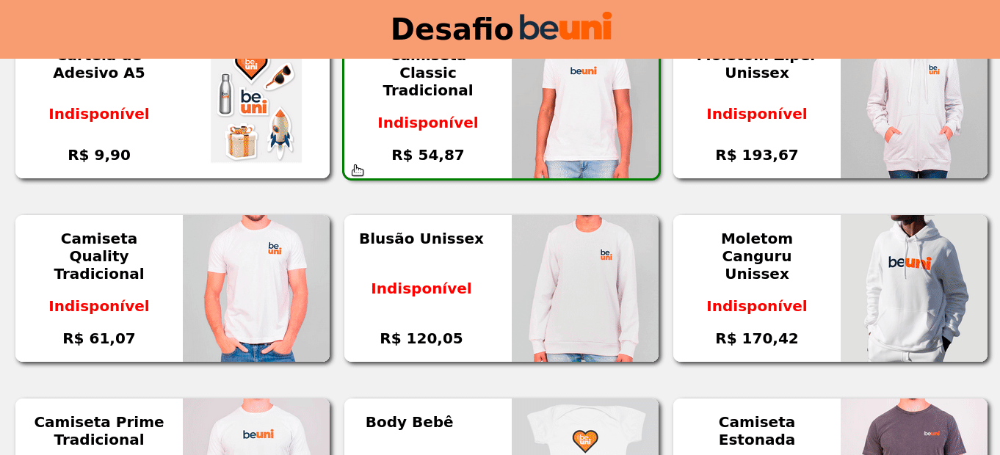

# Desafio beUni

<div align="center">

  <h3>Construído com</h3>

  
  
  
  
  
</div>

<br/>

# Descrição

Desafio técnico do processo seletivo da beUni.

</br>

## Funções

- Listar todos os produtos
- Filtrar os produtos pelo nome
- Exibir as informações de um produto

<h1 align="center" >

</h1>

## Rodar localmente

Clone o projeto

```bash
  git clone https://github.com/ThVinicius/desafio-beuni-front-end.git
```

Vá para o diretório do projeto

```bash
  cd desafio-beuni-front-end
```

Instale as dependências

```bash
  npm install
```

Inicie o servidor

```bash
  npm run dev
```

## Rodar com docker

Vá para o diretório do projeto

```bash
  cd desafio-beuni-front-end
```

Faça o build do container

```bash
docker-compose up --build -d
```

Caso queira parar o container

```bash
docker-compose down
```

</br>

## Acknowledgements

- [Awesome Badges](https://github.com/Envoy-VC/awesome-badges)
